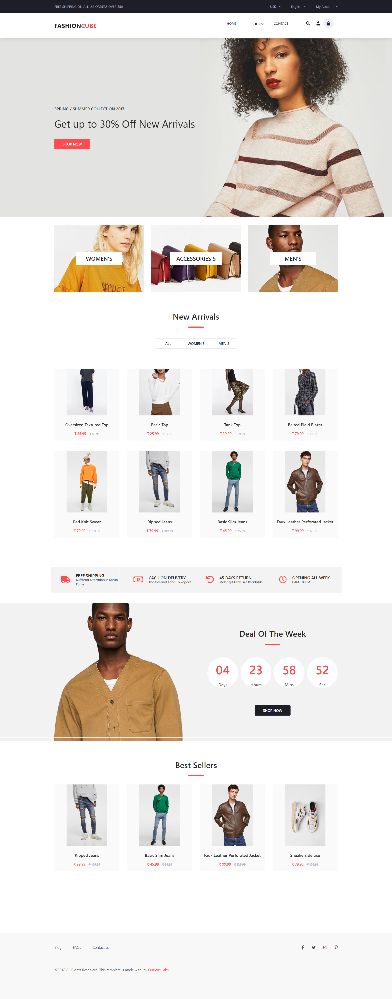
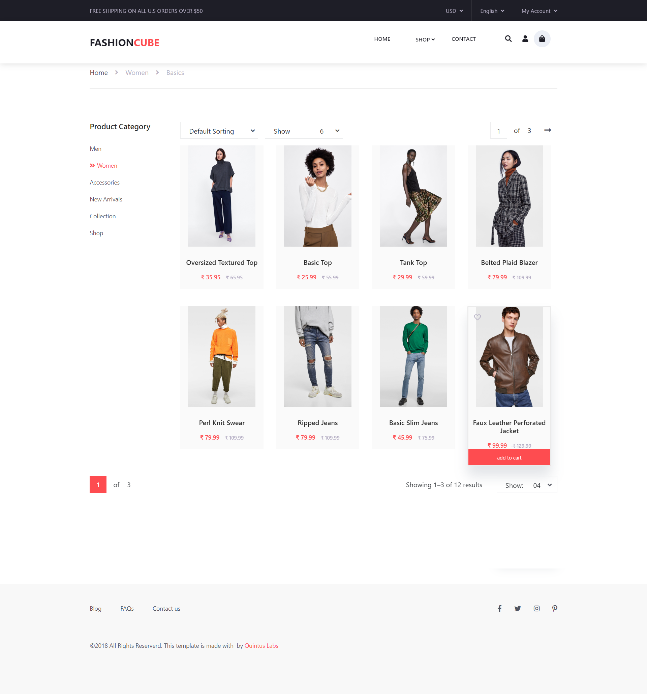
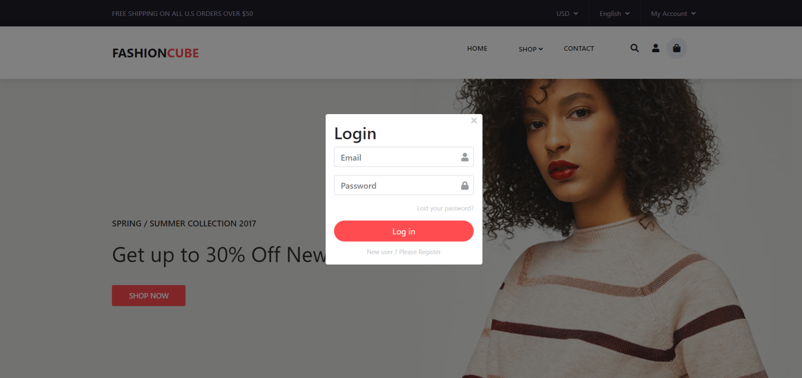
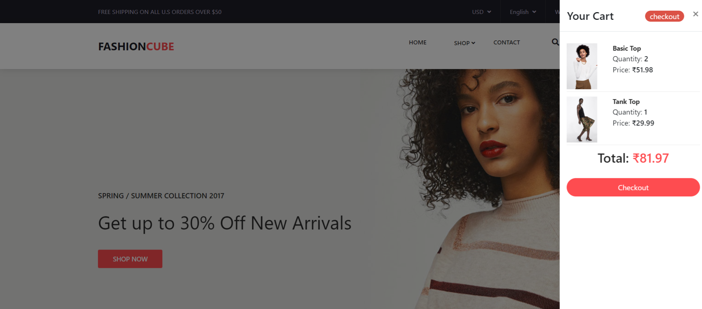
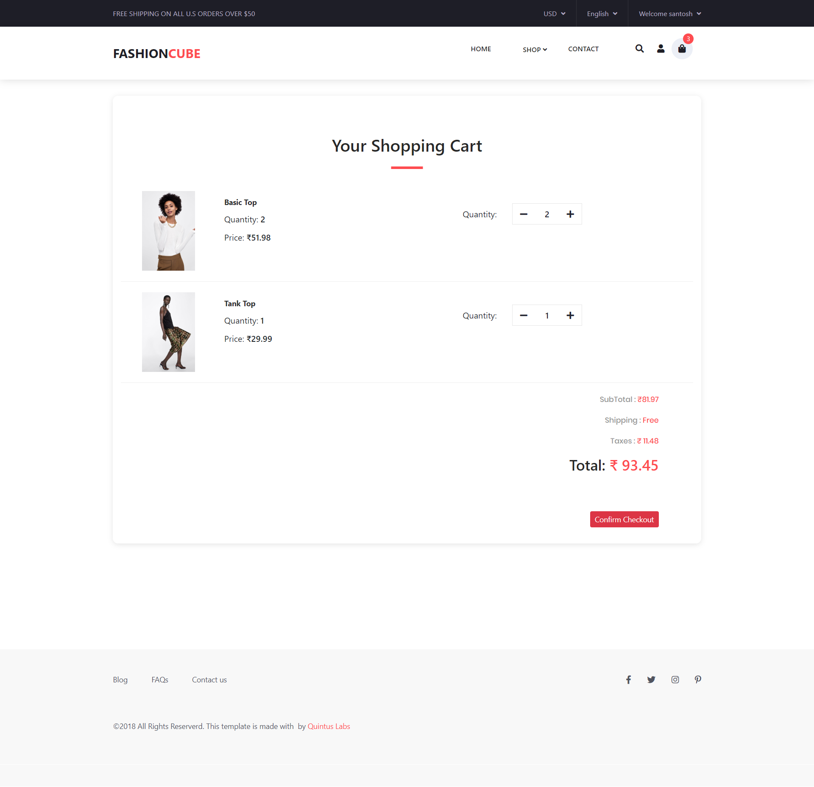

# Fashion Cube-Ecommerce Application

#General Info
<h1>A React JS with redux application</h1>
front-end: Reactjs, Redux, Axios, Sass, react-bootstrap

[Live Demo](https://quintuslabs.github.io/fashion-cube)

## This project is created using:

- [x] React JS
- [x] Redux
- [x] Design System
- [x] Hooks
- [x] Firesase

## Features
- **Home:** List products
- **Detail Products:** View detailed information about a product
- **Product Category:** Browse products by category
- **Recommended Products:** View products recommended for you
- **Cart:** Manage items in your shopping cart
- **Login / Register:** User authentication and account management

## Live link
Check out the live demo [here](#) (link to your live demo).


# ScreenShot







## Future Features

- Enhanced product search
- User reviews and ratings
- Order history
- Wishlist
- Payment integration
- 
# Install dependencies:
```npm install```

# Start the development server:
```http://localhost:3000/```
```npm start```
# Development server start at

``````
License
This project is licensed under the MIT License.
